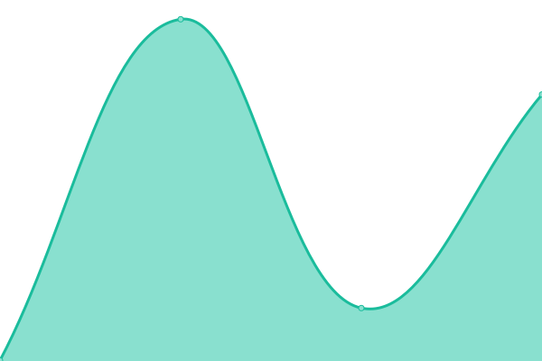

# [📈 Live Status](https://status.sctech.mooo.com): <!--live status--> **🟧 Partial outage**

This repository contains the open-source uptime monitor and status page for [sctech](https://sctech.mooo.com), powered by [Upptime](https://github.com/upptime/upptime).

With [Upptime](https://upptime.js.org), you can get your own unlimited and free uptime monitor and status page, powered entirely by a GitHub repository. We use [Issues](https://github.com/sctech-tr/status/issues) as incident reports, [Actions](https://github.com/sctech-tr/status/actions) as uptime monitors, and [Pages](https://status.sctech.mooo.com) for the status page.

<!--start: status pages-->
<!-- This summary is generated by Upptime (https://github.com/upptime/upptime) -->
<!-- Do not edit this manually, your changes will be overwritten -->
<!-- prettier-ignore -->
| URL | Status | History | Response Time | Uptime |
| --- | ------ | ------- | ------------- | ------ |
|  [sctech.mooo.com - mirror 1](https://sctech.mooo.com) | 🟩 Up | [sctech-mooo-com-mirror-1.yml](https://github.com/sctech-tr/status/commits/HEAD/history/sctech-mooo-com-mirror-1.yml) | 

 181ms
     
 | 

<a href="https://status.sctech.mooo.com/history/sctech-mooo-com-mirror-1">100.00%</a>
    

|  [sctech.pages.gay - mirror 2](https://sctech.pages.gay) | 🟩 Up | [sctech-pages-gay-mirror-2.yml](https://github.com/sctech-tr/status/commits/HEAD/history/sctech-pages-gay-mirror-2.yml) | 

 723ms
     
 | 

<a href="https://status.sctech.mooo.com/history/sctech-pages-gay-mirror-2">99.74%</a>
    

|  [sctech.netlify.app - mirror 3](https://sctech.netlify.app) | 🟩 Up | [sctech-netlify-app-mirror-3.yml](https://github.com/sctech-tr/status/commits/HEAD/history/sctech-netlify-app-mirror-3.yml) | 

 208ms
     
 | 

<a href="https://status.sctech.mooo.com/history/sctech-netlify-app-mirror-3">100.00%</a>
    

|  [sctech link shortener](https://go.sctech.mooo.com) | 🟩 Up | [sctech-link-shortener.yml](https://github.com/sctech-tr/status/commits/HEAD/history/sctech-link-shortener.yml) | 

 283ms
     
 | 

<a href="https://status.sctech.mooo.com/history/sctech-link-shortener">100.00%</a>
    

|  [statuspage](https://status.sctech.mooo.com) | 🟩 Up | [statuspage.yml](https://github.com/sctech-tr/status/commits/HEAD/history/statuspage.yml) | 

 172ms
     
 | 

<a href="https://status.sctech.mooo.com/history/statuspage">100.00%</a>
    

|  [example statuspage](https://sctech.mooo.com/statuspage/) | 🟩 Up | [example-statuspage.yml](https://github.com/sctech-tr/status/commits/HEAD/history/example-statuspage.yml) | 

 33ms
     
 | 

<a href="https://status.sctech.mooo.com/history/example-statuspage">100.00%</a>
    

|  [kanban board demo](https://kanban-demo-iauy.onrender.com) | 🟥 Down | [kanban-board-demo.yml](https://github.com/sctech-tr/status/commits/HEAD/history/kanban-board-demo.yml) | 

 2979ms
     
 | 

<a href="https://status.sctech.mooo.com/history/kanban-board-demo">94.97%</a>
    

|  [osearch](https://search.sctech.mooo.com) | 🟩 Up | [osearch.yml](https://github.com/sctech-tr/status/commits/HEAD/history/osearch.yml) | 

 535ms
     
 | 

<a href="https://status.sctech.mooo.com/history/osearch">100.00%</a>
    

|  [lwytui](https://lwytui.github.io) | 🟩 Up | [lwytui.yml](https://github.com/sctech-tr/status/commits/HEAD/history/lwytui.yml) | 

 85ms
     
 | 

<a href="https://status.sctech.mooo.com/history/lwytui">100.00%</a>
    

|  [openprofile (main)](https://openprofile.is-cool.dev) | 🟩 Up | [openprofile-main.yml](https://github.com/sctech-tr/status/commits/HEAD/history/openprofile-main.yml) | 

 112ms
     
 | 

<a href="https://status.sctech.mooo.com/history/openprofile-main">100.00%</a>
    

|  [openprofile (us.to)](https://openprofile.us.to) | 🟩 Up | [openprofile-us-to.yml](https://github.com/sctech-tr/status/commits/HEAD/history/openprofile-us-to.yml) | 

 199ms
     
 | 

<a href="https://status.sctech.mooo.com/history/openprofile-us-to">100.00%</a>
    

|  [openprofile (netlify)](https://generate-openprofile.netlify.app) | 🟩 Up | [openprofile-netlify.yml](https://github.com/sctech-tr/status/commits/HEAD/history/openprofile-netlify.yml) | 

 293ms
     
 | 

<a href="https://status.sctech.mooo.com/history/openprofile-netlify">100.00%</a>
    

|  [openprofile url shortener](https://opr.ix.tc) | 🟩 Up | [openprofile-url-shortener.yml](https://github.com/sctech-tr/status/commits/HEAD/history/openprofile-url-shortener.yml) | 

 258ms
     
 | 

<a href="https://status.sctech.mooo.com/history/openprofile-url-shortener">96.35%</a>
    

|  [about openprofile](https://about.openprofile.is-cool.dev) | 🟩 Up | [about-openprofile.yml](https://github.com/sctech-tr/status/commits/HEAD/history/about-openprofile.yml) | 

 171ms
     
 | 

<a href="https://status.sctech.mooo.com/history/about-openprofile">100.00%</a>
    

|  [wwwterminal](https://wwwterminal.h4ck.me) | 🟩 Up | [wwwterminal.yml](https://github.com/sctech-tr/status/commits/HEAD/history/wwwterminal.yml) | 

 228ms
     
 | 

<a href="https://status.sctech.mooo.com/history/wwwterminal">100.00%</a>
    

|  [rmsh website](https://remote-shell.github.io) | 🟩 Up | [rmsh-website.yml](https://github.com/sctech-tr/status/commits/HEAD/history/rmsh-website.yml) | 

 523ms
     
 | 

<a href="https://status.sctech.mooo.com/history/rmsh-website">100.00%</a>
    

|  [note and flush website](https://noteflush.github.io) | 🟩 Up | [note-and-flush-website.yml](https://github.com/sctech-tr/status/commits/HEAD/history/note-and-flush-website.yml) | 

 93ms
     
 | 

<a href="https://status.sctech.mooo.com/history/note-and-flush-website">100.00%</a>
    

|  [‌](https://pinariko.github.io) | 🟩 Up | [.yml](https://github.com/sctech-tr/status/commits/HEAD/history/.yml) | 

 101ms
     
 | 

<a href="https://status.sctech.mooo.com/history/">0.00%</a>
    

|  [lolchat](https://lolch4t.netlify.app) | 🟩 Up | [lolchat.yml](https://github.com/sctech-tr/status/commits/HEAD/history/lolchat.yml) | 

 366ms
     
 | 

<a href="https://status.sctech.mooo.com/history/lolchat">100.00%</a>
    

|  [lolchat backend](https://lolchat-backend.onrender.com) | 🟥 Down | [lolchat-backend.yml](https://github.com/sctech-tr/status/commits/HEAD/history/lolchat-backend.yml) | 

 229ms
     
 | 

<a href="https://status.sctech.mooo.com/history/lolchat-backend">0.05%</a>
    

<!--end: status pages-->

[**Visit our status website →**](https://status.sctech.mooo.com)

## 📄 License

- Powered by: [Upptime](https://github.com/upptime/upptime)
- Code: [MIT](./LICENSE) © [Anand Chowdhary](https://anandchowdhary.com), supported by [Pabio](https://pabio.com)
- Data in the `./history` directory: [Open Database License](https://opendatacommons.org/licenses/odbl/1-0/)
